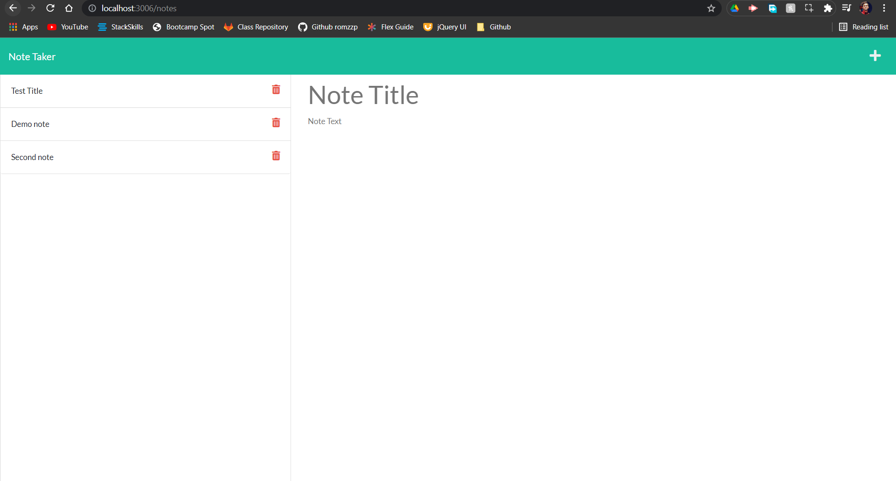

# Note-Taker

# Description:

This application is works as a note taking app. Ther user here can create notes and can save and delete the notes. The user can create multiple notes with this app.

# Installation:

Install all the required dependencies by 'npm i', and then run the command 'npm start'

# Github Repo:

- [Repo](https://github.com/romzzp/Note-Taker)

# Heroku App:

- [App](https://rj-note-taker.herokuapp.com/)

# Screenshot:

Screenshot of the home page

Screenshot of the page where you can write,save and delete notes

# Questions:

Any questions regarding this project can be directed at:

- [Github User](https://github.com/romzzp)
- Email: romzz.patel@gmail.com
